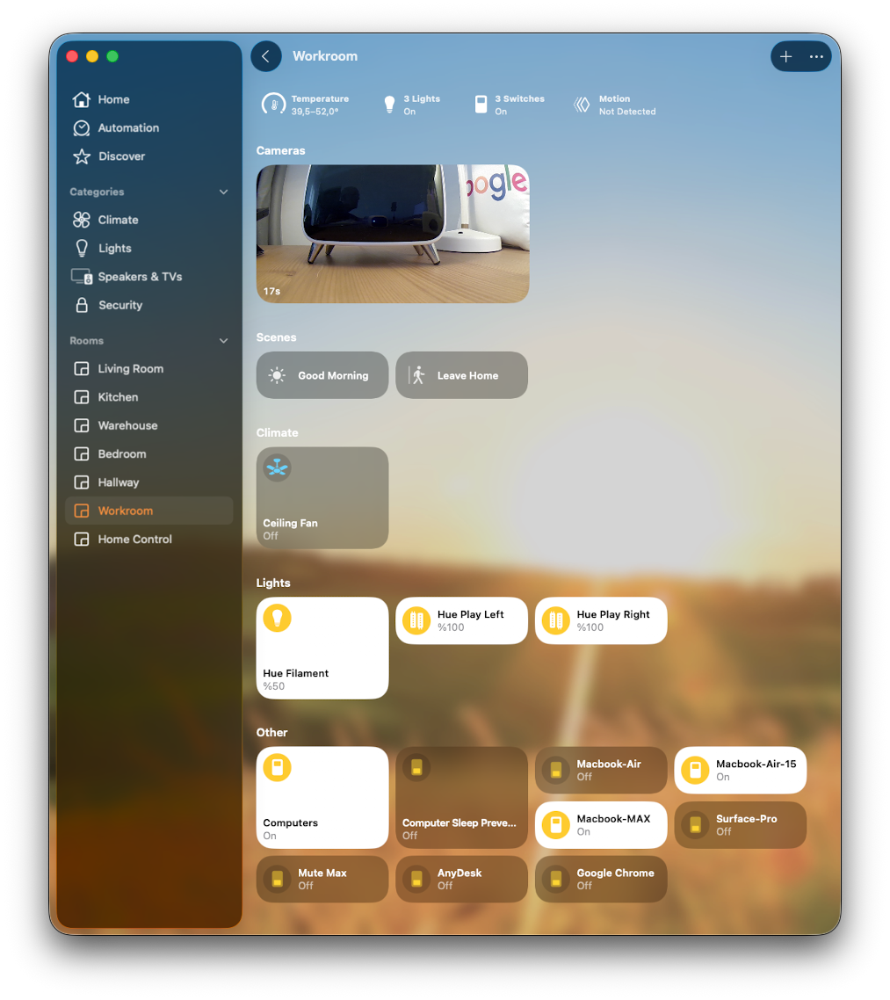
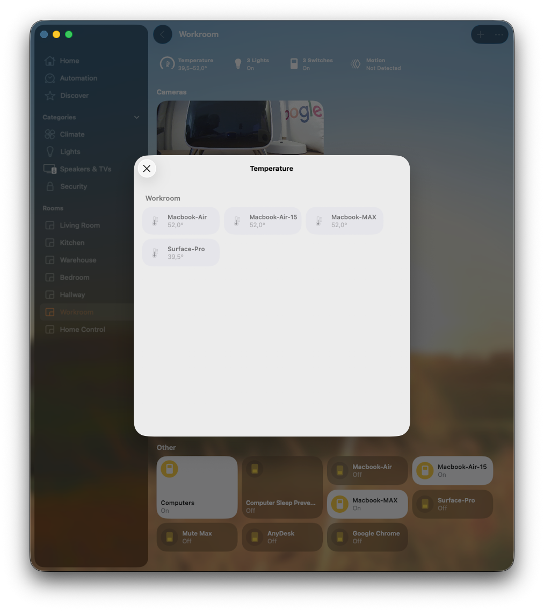
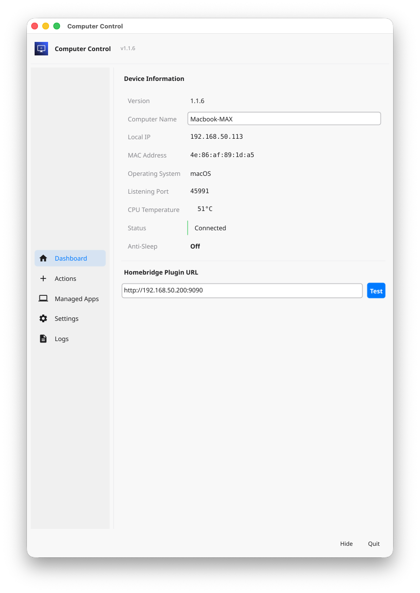
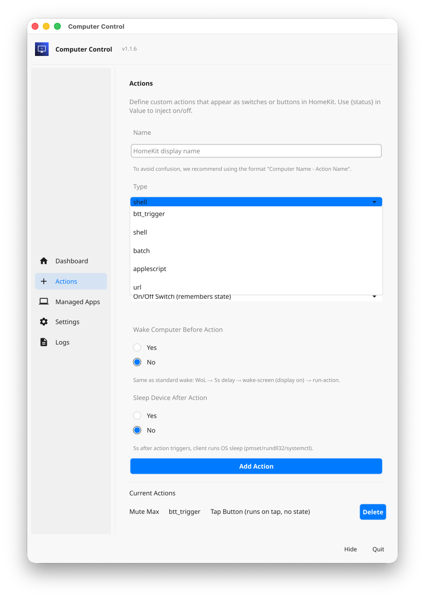
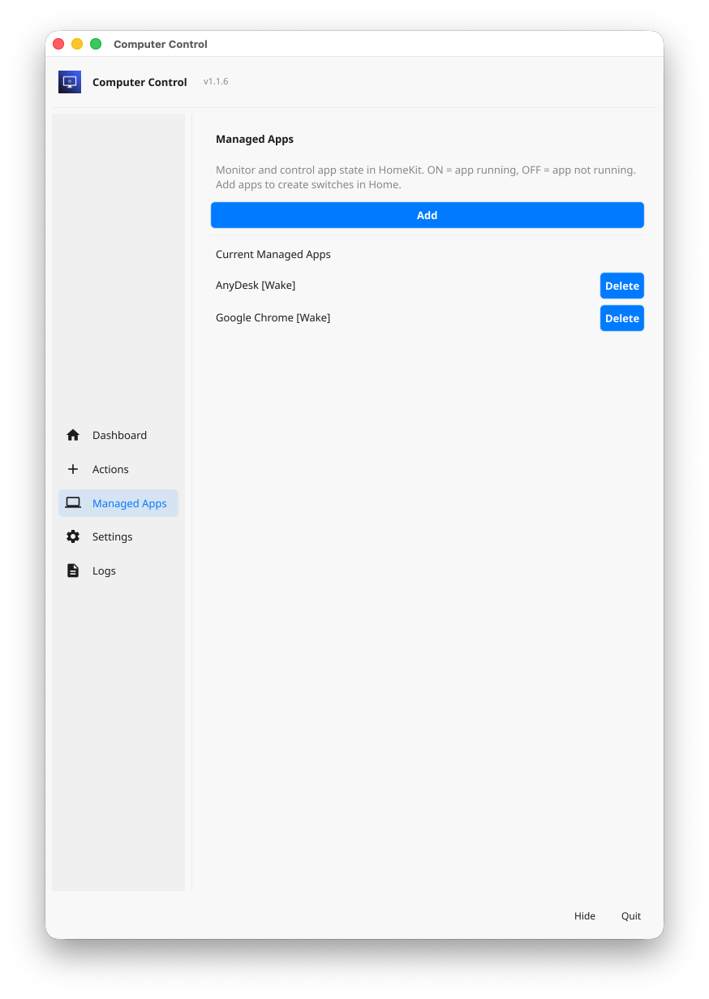
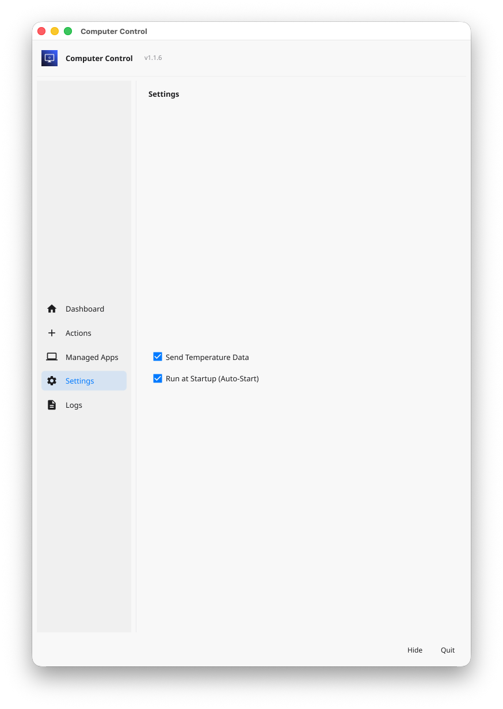

# 🏠 HomeBridge Computer Control

[](https://www.npmjs.com/package/homebridge-computer-control)
[](https://www.npmjs.com/package/homebridge-computer-control)
[](https://opensource.org/licenses/MIT)
[](https://github.com/orkank/homebridge-computer-control/stargazers)
[](https://github.com/orkank/homebridge-computer-control/network)

<p align="center">
  
  
</p>

<p align="center">
  
  
  
  
</p>

> ⚠️ **Test version** — This plugin is still in testing.

Control your computers (macOS, Windows, Linux) through Apple HomeKit using Homebridge. Wake them with WoL, put them to sleep remotely, and manage them as HomeKit switches.

**Version:** 1.1.6

### 📱 Managed Apps — Live Application Monitoring (Real-State)

**Managed Apps** lets you monitor and control running applications directly from HomeKit. Each app becomes a switch: **ON** = app is running, **OFF** = app is not running. Unlike fire-and-forget actions, the switch state reflects the **actual process state** from the client.

| Feature | Description |
|---------|-------------|
| **Real-State Switch** | Switch reflects only client-reported `app_states` — never from user tap. If you turn OFF in HomeKit, the switch stays ON until the app actually quits |
| **Add Process** | Client **Managed Apps** tab → Add → select from running processes (searchable list). macOS: clean `.app` names; Windows: includes `.exe` |
| **Launch / Quit** | Client `/manage-app?name=X&target=on\|off` — launch app or force-kill all matching processes |
| **Wake Before Launch** | Same as Actions: WoL → 5s delay → wake-screen → launch app |
| **Sleep After Quit** | Same as Actions: 5 seconds after quit, client runs OS sleep (pmset/rundll32/systemctl) |

Storage: `managed_apps.json` in the same config dir as `actions.json`. Each app: `{name, wakeBefore, sleepAfter}`.

### 🎯 Custom Actions — One-Tap HomeKit Accessories

Define actions in the client **Actions** tab; they appear instantly as switches or buttons in HomeKit. No manual config — every action you add shows up automatically in the Home app.

| Platform | Available Actions |
|----------|------------------------|
| **macOS** | **BTT** (BetterTouchTool), Shell, Batch, AppleScript, URL |
| **Linux** | Shell, Batch, URL |
| **Windows** | Batch, URL |

**macOS + BetterTouchTool:** With BTT installed, you can bind any BTT CLI command to a HomeKit accessory with one tap. Commands like `trigger_named "mute"`, `display_notification "Hello"`, or `set_string_variable` — add them in the client Actions tab → they appear as switches/buttons in Home → trigger via Siri or automations.

> **Note:** BTT's Command Line / Socket Server must be enabled in BetterTouchTool's Scripting Settings first. See [BTT CLI documentation](https://docs.folivora.ai/docs/scripting/cli) for details.

**Trigger by UUID:** You can also trigger any BTT trigger by its UUID: `execute_assigned_actions_for_trigger 823A845F-8D62-4950-8709-1CE5527CEADF`. Find the UUID in BTT (right-click trigger → Copy UUID) and add it as an action — no need to use the trigger name.

**Example uses:** Mute/unmute, show notifications, set variables, open URLs, run scripts, trigger shortcuts. Choose Toggle (remembers state) or Push Button (one-shot).

**Wake Before / Sleep After:** Each action can optionally enable:
- **Wake Computer Before Action** — Same flow as standard wake: WoL → 5s delay → wake-screen (display on) → run-action. Ensures display wakes from Dark Wake.
- **Sleep Device After Action** — 5 seconds after the action triggers, the client runs the OS sleep command (macOS: pmset sleepnow, Windows: rundll32, Linux: systemctl suspend).

## Features

| Feature | Description |
|---------|-------------|
| **Wake-on-LAN** | Wake sleeping computers from anywhere via HomeKit |
| **Remote Sleep** | Put computers to sleep with a single tap |
| **Group Control** | Virtual "Computers" accessory — Wake All / Sleep All in one command |
| **Auto-Registration** | Clients register automatically; no manual config needed |
| **Update Notification** | Clients receive a one-time update notification with download link |
| **macOS Power Nap** | Correctly detects Dark Wake; device stays OFF when display is asleep |
| **Token Auth** | Client and plugin use shared tokens; no unauthorized sleep/wake |
| **Config UI** | View clients, remove stale ones, configure group name |
| **Anti-Sleep** | Virtual switch to prevent all computers from sleeping (configurable name + optional timer) |
| **Temperature Sensor** | Optional CPU temperature in HomeKit (client checkbox "Send Temperature Data"); Linux thermal/sensors, macOS ioreg, Windows WMI |
| **Custom Actions** | Define BTT, shell, batch, AppleScript, or URL actions in the client; they appear as switches or buttons in HomeKit |
| **Managed Apps** | Live app monitoring — add process names in client; each becomes a real-state switch (ON = running, OFF = not running). Launch/quit from HomeKit; optional Wake Before Launch / Sleep After Quit |

## Architecture

```
┌──────────────────────────────────────────────────────────┐
│                    Apple Home / HomeKit                  │
└────────────────────────────┬─────────────────────────────┘
                             │
┌────────────────────────────▼─────────────────────────────┐
│                   Homebridge Plugin                      │
│  ┌─────────────┐  ┌──────────────┐  ┌─────────────────┐  │
│  │ Registration│  │ Wake-on-LAN  │  │  Status Check   │  │
│  │   Server    │  │   (Power On) │  │  (HTTP)         │  │
│  └─────────────┘  └──────────────┘  └─────────────────┘  │
│  ┌──────────────────────────────────────────────────────┐│
│  │        📥 Binary Download Server (:9090)             ││
│  └──────────────────────────────────────────────────────┘│
└────────────────────────────┬─────────────────────────────┘
                             │ HTTP / WoL
        ┌────────────────────┼────────────────────┐
        │                    │                    │
┌───────▼──────┐  ┌──────────▼─────┐  ┌───────────▼────┐
│  Go Client   │  │   Go Client    │  │   Go Client    │
│  (macOS)     │  │   (Windows)    │  │   (Linux)      │
│  .app bundle │  │   .exe (GUI)   │  │   binary       │
│  Hidden Agent│  │   No Console   │  │   GUI          │
└──────────────┘  └────────────────┘  └────────────────┘
```

## Project Structure (Single NPM Package)

```
homebridge-computer-control/
├── package.json              ← Homebridge plugin manifest
├── tsconfig.json             ← TypeScript config
├── config.schema.json        ← Config UI X schema
├── .gitignore
├── README.md
│
├── src/                      ← Plugin TypeScript source
│   ├── index.ts              ← Plugin entry point
│   ├── platform.ts           ← Main platform (registration, WoL, downloads)
│   ├── platformAccessory.ts  ← HomeKit Switch handler
│   ├── settings.ts           ← Constants & interfaces
│   └── types.d.ts            ← Type declarations
│
├── dist/                     ← Compiled plugin (generated)
│
├── client/                   ← Go client source
│   ├── main.go               ← Client binary source
│   └── go.mod                ← Go module
│
├── examples/                 ← Example scripts for actions
│   ├── example.sh            ← Shell (macOS/Linux)
│   ├── example.bat           ← Batch (Windows)
│   └── example.applescript   ← AppleScript (macOS)
│
├── bin/                      ← Pre-compiled client binaries (generated)
│   ├── ComputerControl.app/  ← macOS hidden agent bundle
│   │   └── Contents/
│   │       ├── Info.plist     ← LSUIElement=true (no Dock icon)
│   │       └── MacOS/
│   │           └── client
│   ├── computer-control-darwin-app.zip
│   ├── computer-control-windows-amd64.exe
│   └── computer-control-linux-amd64[.tar.xz]  ← if built
│
└── scripts/
    └── build-clients.sh      ← Cross-compilation script
```

## Quick Start

### 1. Build Everything
```bash
# Install dependencies & build clients + plugin
npm install
npm run build:all
```

### 2. Build Only Clients (Go Binaries)
```bash
npm run build:clients
# or directly:
bash scripts/build-clients.sh
```

### 3. Install Plugin in Homebridge
```bash
npm run build
npm link
# or install globally for Homebridge
sudo npm install -g ./
```

### 4. Homebridge Config

> ⚠️ **Required** — The plugin will **not work** until the platform is added to your config. After installing, open the plugin settings in Homebridge Config UI X and **Save** the configuration. Or add the platform manually to `config.json`.

Add to your `config.json` (or use Config UI X → Plugins → Computer Control → Save):
```json
{
  "platforms": [
    {
      "platform": "ComputerControl",
      "name": "Computer Control",
      "registrationPort": 9090,
      "groupAccessoryName": "Computers",
      "antiSleepDeviceName": "Computer Sleep Prevention",
      "antiSleepTimer": 0,
      "clients": []
    }
  ]
}
```

**Docker:** If Homebridge runs in Docker, ensure port **9090** is exposed (registration + download server). Example: `-p 9090:9090`

### 5. Download & Run Client on Target Computers

Once the plugin is running, clients can be downloaded from:
```
http://<homebridge-ip>:9090/download
```

| Platform | Endpoint | Notes |
|---|---|---|
| macOS (.app bundle) | `/download/darwin-app` | Zip with .app; hidden agent (no Dock icon); see [macOS Gatekeeper](#macos-gatekeeper) below |
| Windows (64-bit) | `/download/windows-amd64` | No console window |
| Windows (ARM) | `/download/windows-arm64` | No console window |
| Linux (64-bit) | `/download/linux-amd64` | Standalone binary |
| Linux (ARM64) | `/download/linux-arm64` | For Raspberry Pi etc. |

#### macOS Gatekeeper

macOS quarantines apps downloaded from the internet. If you see **"ComputerControl.app is damaged and can't be opened"**, run this in Terminal before first launch:

```bash
xattr -cr ComputerControl.app
```

Alternatively: right-click the app → **Open** (first time only).

### 6. Run the Client
```bash
# macOS: Extract the zip, then run (see macOS Gatekeeper above for first launch)
open ComputerControl.app --args --plugin-url http://<homebridge-ip>:9090

# Windows: Run the .exe with plugin URL
computer-control-windows-amd64.exe --plugin-url http://<homebridge-ip>:9090

# Linux: Run the binary
./computer-control-linux-amd64 --plugin-url http://<homebridge-ip>:9090

# The client auto-detects IP, MAC, and OS (default port: 45991)
# Check version (CLI or GUI)
./computer-control-linux-amd64 --version   # or use GUI About
```

## Changelog

### 1.1.6 (Current)

- **Managed Apps — Live Application Monitoring**: New feature for real-state app control
  - Client **Managed Apps** tab: add process names from running processes (searchable list, instant refresh)
  - Each app becomes a HomeKit switch: ON = running, OFF = not running (state from client heartbeat only)
  - Launch app (target=on) or force-kill (target=off) via `/manage-app` endpoint
  - **Wake Before Launch**: Same as Actions — WoL → 5s → wake-screen → launch
  - **Sleep After Quit**: Same as Actions — 5s after quit, client runs OS sleep
  - Storage: `managed_apps.json` with `{name, wakeBefore, sleepAfter}` per app
  - macOS: clean `.app` names; Windows: `.exe` in list; case-insensitive matching
- **Add modal UX**: Managed Apps add dialog enlarged; Entry + filterable List (type to search); auto-focus on open

### 1.1.5

- **Wake Before Action**: Per-action option to wake the computer before running (WoL → 5s delay → wake-screen → run-action). Same flow as standard wake; display wakes from Dark Wake.
- **Sleep After Action**: Per-action option to put the computer to sleep 5 seconds after the action triggers. macOS: `pmset sleepnow` (osascript fallback). Stored as `wakeBefore` and `sleepAfter` in `actions.json`.
- **Config defaults**: Custom UI merges missing defaults when config is minimal (name, registrationPort, etc.).

### 1.1.4

- **Custom Actions**: Define actions in the client (BTT, shell, batch, AppleScript, URL) — they appear as HomeKit switches or tap buttons
  - Client Actions tab: add/delete actions; `actions.json` storage; heartbeat includes actions
  - Toggle (remembers state) or Push Button (one-shot); `{status}` substitution for on/off
  - BTT: full path to bttcli; args passed correctly (no shell wrapping)
  - AppleScript: file path (`.applescript`/`.scpt`) or inline script; `~` expansion
  - URL: HTTP request (async) or open in default browser
- **Platform-specific actions**: macOS (all); Linux (shell, batch, url); Windows (batch, url only)
- **Client UI**: Larger main window (620×720); Delete button blue/white; action name hint (no auto hostname prefix)
- **Example scripts**: `examples/` folder with example.sh, example.bat, example.applescript
- **Plugin fix**: `@homebridge/plugin-ui-utils` in dependencies + `homebridge-ui` in files — Config UI opens correctly on Node 20

### 1.1.2 / 1.1.3

- Plugin config did not open in Homebridge Config UI X (broken fix for Node 20 compatibility)

### 1.1.1

- **macOS Dark Mode**: Hide/Quit buttons use light text on dark window frame; sidebar, separators, and sidebar items follow system light/dark theme
- **Temperature Sensor**: Optional CPU temperature in HomeKit
  - Client checkbox "Send Temperature Data"; persisted in `client_config.json`
  - macOS: gopsutil sensors (SMC/HID), ioreg, system_profiler, powermetrics
  - Windows: WMI (MSAcpi_ThermalZoneTemperature, ThermalZoneInformation, Win32_TemperatureProbe)
  - Linux: sysfs thermal zones, `sensors` fallback
  - Dynamic add/remove of TemperatureSensor service based on client data
- **Windows**: HideWindow for exec (no console pop-ups); multi-WMI temperature fallbacks

### 1.1.0

- **Anti-Sleep device**: Virtual switch to prevent all computers from sleeping
  - Config: `antiSleepDeviceName` (default: "Computer Sleep Prevention"), `antiSleepTimer` (minutes, 0 = unlimited)
  - Siri: "Hey Siri, turn on [name]"
  - Client: `/stay-awake?enabled=true|false` — macOS: caffeinate -i, Windows: SetThreadExecutionState, Linux: systemd-inhibit
  - Client GUI: Anti-Sleep status indicator when active
- **Update notification**: Replaced auto-update with one-time notification; Download button opens link in browser
- **macOS client**: Zip distribution; Gatekeeper note (xattr -cr) in README and update dialog
- **Tray**: Left-click opens main window; About removed from menu

### 1.0.0

- **Group accessory**: Virtual "Computers" switch — Wake All / Sleep All (configurable name)
- **Auto-update**: Clients check version on heartbeat; download and self-update when plugin is newer
- **Token auth**: Plugin issues tokens on registration; client accepts only token-bearing requests (sleep, health, wake-screen)
- **macOS Dark Wake**: Uses `system_profiler SPDisplaysDataType` for Apple Silicon; `ioreg` fallback for Intel
- **Health check**: Plugin uses HTTP `/health` only (no ping); 10s timeout; treats `isDarkWake` as OFFLINE
- **Client port**: Default 45991 (was 8080) to avoid conflicts
- **Config UI**: Delete clients from list; inline confirmation (no `window.confirm`); badge contrast fix
- **HomeKit name**: When device display name changes, `updateDisplayName` + AccessoryInformation Name are updated
- **Auto-start**: Removed `launchctl load`; plist is only created; second instance is prevented
- **Response**: Removed raw fields from `displayState` (`ioregRaw`, `systemProfilerRaw`, `pmsetLastEvent`)

---

## Client Behavior

| Feature | Details |
|---|---|
| **Auto-Detection** | IP, MAC address, hostname detected on startup |
| **Heartbeat** | Sends registration every 30 seconds |
| **Sleep (macOS)** | `pmset sleepnow` (osascript fallback) |
| **Sleep (Windows)** | `rundll32.exe powrprof.dll,SetSuspendState 0,1,0` |
| **Sleep (Linux)** | `systemctl suspend` |
| **macOS Hidden** | `.app` with `LSUIElement=true` — no Dock icon, no terminal |
| **Windows Hidden** | Built with `-H windowsgui` — no console window |
| **Version** | `--version` flag prints version; GUI shows version in header, info form, and About |
| **Temperature** | Optional "Send Temperature Data" checkbox; persisted in `client_config.json`; only reads CPU temp when enabled (minimizes CPU load) |
| **Actions** | Define custom actions (BTT, shell, batch, AppleScript, URL) in Actions tab; stored in `actions.json`; appear as HomeKit switches/buttons |
| **Managed Apps** | Add process names in Managed Apps tab; stored in `managed_apps.json`; heartbeat sends `app_states` (name → running); each app becomes a real-state switch in HomeKit |

### Temperature Sensor (Optional)

| Platform | Method |
|---|---|
| **Linux** | `/sys/class/thermal/thermal_zone*/temp` (prefer `x86_pkg_temp` or `cpu-thermal`); fallback: `sensors` (Package id 0 / Core 0) |
| **macOS** | gopsutil sensors (SMC on Intel, HID on Apple Silicon); fallback: ioreg, system_profiler, powermetrics |
| **Windows** | WMI `Win32_PerfFormattedData_Counters_ThermalZoneInformation` (HighPrecisionTemperature) |

Value sent in millidegree Celsius; plugin converts to °C (÷1000). When checkbox is off, no temperature is sent and the TemperatureSensor service is removed from the accessory.

### Managed Apps (Live App Monitoring)

| Aspect | Details |
|--------|---------|
| **Process detection** | Client uses `ps` (macOS/Linux) or `tasklist` (Windows) to list running user apps |
| **Naming** | macOS: clean names (e.g. `Safari`, `AnyDesk`); Windows: includes `.exe` (e.g. `AnyDesk.exe`) |
| **Matching** | Case-insensitive; Windows `.exe` handled automatically |
| **Heartbeat** | Before each heartbeat, client checks `IsProcessRunning()` for each managed app; sends `app_states: {AppName: true/false}` |
| **Launch** | macOS: `open -a "AppName"`; Windows: `start "" "AppName"`; Linux: `exec` |
| **Quit** | Force-kill all processes matching the name (gopsutil) |

### macOS Sleep / Power Nap Mitigation

| Mechanism | Description |
|---|---|
| **Going to Sleep** | Client sends `POST /going-to-sleep` before sleeping so the device is set OFF immediately |
| **20s State Lock** | Plugin ignores all signals for 20 seconds after sleep; only Wake command or physical display open sets ONLINE |
| **Heartbeat Filter** | Client checks display state before each heartbeat; if Dark Wake (display asleep), never sends |
| **Apple Silicon** | Uses `system_profiler SPDisplaysDataType` ("Display Asleep: Yes/No"); `ioreg` no longer exposes power state |
| **Full Wake** | `/wake-screen` runs caffeinate + key code 123 (user-active signal) + brightness max |

### Windows Notes

- **Status check**: Uses HTTP `/health` only (ping removed). Ensure client port (45991) is reachable from Homebridge.
- **Sleep**: If sleep commands fail, ensure Windows Firewall allows incoming connections on the client port (default 45991), and that the Homebridge host can reach the client's IP (e.g. same subnet or proper routing).

## Plugin API Endpoints (Port 9090)

| Method | Path | Description |
|---|---|---|
| `POST` | `/register` | Client heartbeat/registration (returns token; may include update info) |
| `POST` | `/going-to-sleep` | Client notifies before sleeping (body: `{"mac":"..."}`) |
| `GET` | `/clients` | List all registered clients |
| `DELETE` | `/clients/:mac` | Remove a client |
| `GET` | `/download` | List available client binaries |
| `GET` | `/download/:platform` | Download a client binary |

## Client Endpoints (Port 45991)

All client endpoints require `X-Auth-Token` header (issued by plugin on registration).

| Method | Path | Description |
|---|---|---|
| `GET` | `/health` | Liveness + `isDarkWake` (plugin uses for ONLINE/OFFLINE) |
| `GET` | `/status` | Hostname, uptime, display state |
| `POST` | `/sleep` | Put computer to sleep |
| `POST` | `/wake-screen` | Force display wake (macOS: caffeinate + key + brightness) |
| `GET` | `/stay-awake?enabled=true\|false` | Enable/disable system sleep prevention (Anti-Sleep) |
| `GET` | `/run-action?name=X&state=on\|off` | Execute a named action (BTT, shell, batch, AppleScript, URL) |
| `GET` | `/manage-app?name=X&target=on\|off` | Launch app (target=on) or kill all processes matching name (target=off) |

## Publishing (Maintainers)

```bash
# 1. Build plugin + client binaries (bin/ required for download server)
npm run build:all

# 2. Publish to npm
npm publish
```

## License
MIT

## Developer

Orkan K.
